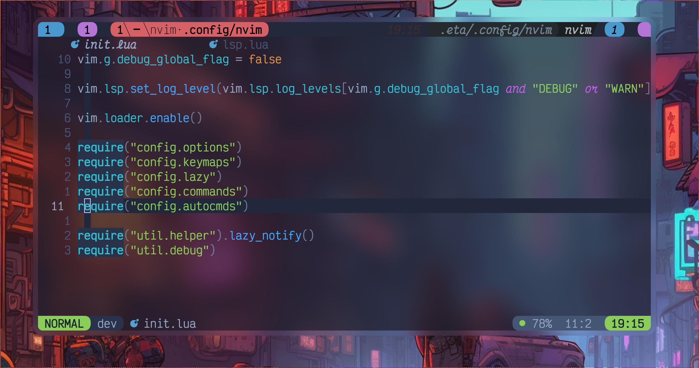

# Neovim Config

<!-- plugins:start -->

## Plugins

- [align.nvim](https://github.com/Vonr/align.nvim)
- [bufferline.nvim](https://github.com/akinsho/bufferline.nvim)
- [cmp-buffer](https://github.com/hrsh7th/cmp-buffer)
- [cmp-nvim-lsp](https://github.com/hrsh7th/cmp-nvim-lsp)
- [cmp-path](https://github.com/hrsh7th/cmp-path)
- [cmp_luasnip](https://github.com/saadparwaiz1/cmp_luasnip)
- [colortils.nvim](https://github.com/max397574/colortils.nvim)
- [dial.nvim](https://github.com/monaqa/dial.nvim)
- [dressing.nvim](https://github.com/stevearc/dressing.nvim)
- [flash.nvim](https://github.com/folke/flash.nvim)
- [friendly-snippets](https://github.com/rafamadriz/friendly-snippets)
- [gitignore.nvim](https://github.com/wintermute-cell/gitignore.nvim)
- [hydra.nvim](https://github.com/smoka7/hydra.nvim)
- [inc-rename.nvim](https://github.com/smjonas/inc-rename.nvim)
- [indent-blankline.nvim](https://github.com/lukas-reineke/indent-blankline.nvim)
- [jq.vim](https://github.com/vito-c/jq.vim)
- [kdl.vim](https://github.com/imsnif/kdl.vim)
- [lazy.nvim](https://github.com/folke/lazy.nvim)
- [lualine.nvim](https://github.com/nvim-lualine/lualine.nvim)
- [LuaSnip](https://github.com/L3MON4D3/LuaSnip)
- [mason-lspconfig.nvim](https://github.com/williamboman/mason-lspconfig.nvim)
- [mason.nvim](https://github.com/williamboman/mason.nvim)
- [mini.ai](https://github.com/echasnovski/mini.ai)
- [mini.align](https://github.com/echasnovski/mini.align)
- [mini.clue](https://github.com/echasnovski/mini.clue)
- [mini.comment](https://github.com/echasnovski/mini.comment)
- [mini.cursorword](https://github.com/echasnovski/mini.cursorword)
- [mini.files](https://github.com/echasnovski/mini.files)
- [mini.hipatterns](https://github.com/echasnovski/mini.hipatterns)
- [mini.hues](https://github.com/echasnovski/mini.hues)
- [mini.indentscope](https://github.com/echasnovski/mini.indentscope)
- [mini.map](https://github.com/echasnovski/mini.map)
- [mini.operators](https://github.com/echasnovski/mini.operators)
- [mini.pairs](https://github.com/echasnovski/mini.pairs)"
- [mini.splitjoin](https://github.com/echasnovski/mini.splitjoin)
- [mini.starter](https://github.com/echasnovski/mini.starter)
- [mini.surround](https://github.com/echasnovski/mini.surround)
- [multicursors.nvim](https://github.com/smoka7/multicursors.nvim)
- [neo-tree.nvim](https://github.com/nvim-neo-tree/neo-tree.nvim)
- [neoconf.nvim](https://github.com/folke/neoconf.nvim)
- [neodev.nvim](https://github.com/folke/neodev.nvim)
- [noice.nvim](https://github.com/folke/noice.nvim)
- [nui.nvim](https://github.com/MunifTanjim/nui.nvim)
- [null-ls.nvim](https://github.com/jose-elias-alvarez/null-ls.nvim)
- [nvim-cmp](https://github.com/hrsh7th/nvim-cmp)
- [nvim-devdocs](https://github.com/luckasRanarison/nvim-devdocs)
- [nvim-lspconfig](https://github.com/neovim/nvim-lspconfig)
- [nvim-navic](https://github.com/SmiteshP/nvim-navic)
- [nvim-notify](https://github.com/rcarriga/nvim-notify)
- [nvim-spectre](https://github.com/nvim-pack/nvim-spectre)
- [nvim-treesitter-textobjects](https://github.com/nvim-treesitter/nvim-treesitter-textobjects)
- [nvim-treesitter](https://github.com/nvim-treesitter/nvim-treesitter)
- [nvim-ts-context-commentstring](https://github.com/JoosepAlviste/nvim-ts-context-commentstring)
- [nvim-web-devicons](https://github.com/nvim-tree/nvim-web-devicons)
- [Navigator.nvim](https://github.com/numToStr/Navigator.nvim)
- [oil.nvim](https://github.com/stevearc/oil.nvim)
- [onedark.nvim](https://github.com/navarasu/onedark.nvim)
- [playground](https://github.com/nvim-treesitter/playground)
- [plenary.nvim](https://github.com/nvim-lua/plenary.nvim)
- [project.nvim](https://github.com/ahmedkhalf/project.nvim)
- [sqlite.lua](https://github.com/kkharji/sqlite.lua)
- [ssr.nvim](https://github.com/cshuaimin/ssr.nvim)
- [symbols-outline.nvim](https://github.com/simrat39/symbols-outline.nvim)
- [SchemaStore.nvim](https://github.com/b0o/SchemaStore.nvim)
- [telescope-file-browser.nvim](https://github.com/nvim-telescope/telescope-file-browser.nvim)
- [telescope-lazy.nvim](https://github.com/tsakirist/telescope-lazy.nvim)
- [telescope.nvim](https://github.com/nvim-telescope/telescope.nvim)
- [twilight.nvim](https://github.com/folke/twilight.nvim)
- [vim-kitty](https://github.com/fladson/vim-kitty)
- [vim-mustache-handlebars](https://github.com/mustache/vim-mustache-handlebars)
- [vim-terraform](https://github.com/hashivim/vim-terraform)
- [yanky.nvim](https://github.com/gbprod/yanky.nvim)
- [zen-mode.nvim](https://github.com/folke/zen-mode.nvim)

<!-- plugins:end -->
